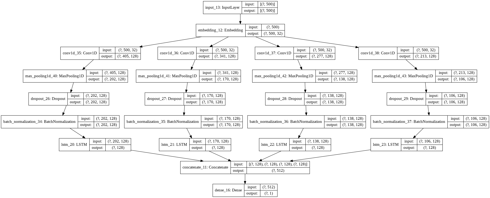
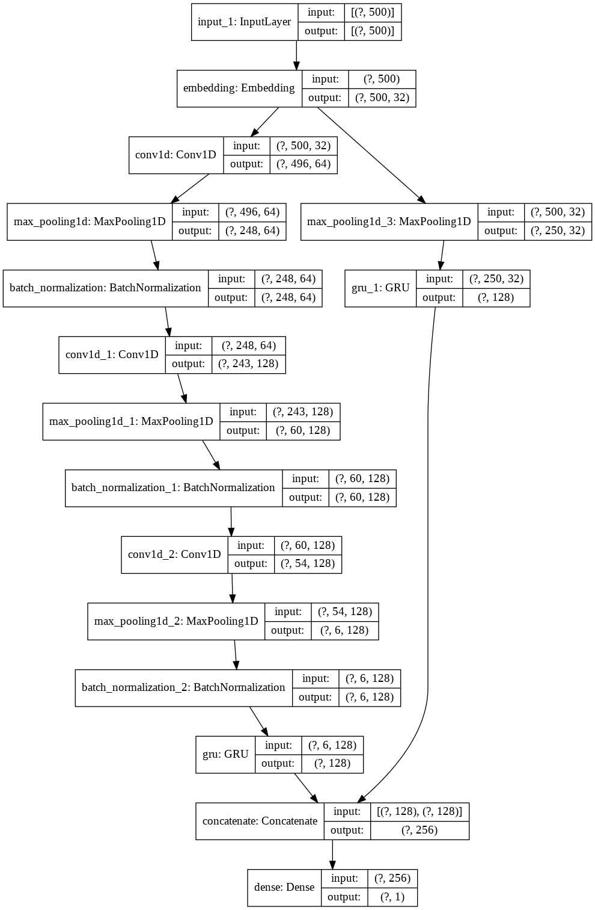

# IMDb-review-sentiment-analysis
Implemented a Deep CNN-LSTM with combined kernels from multiple branches for IMDb review sentiment analysis.
Implementation is inspired from the paper - https://ieeexplore.ieee.org/document/8249013 

# Model-1 Architecture:

# Accuracy - 88.62%

# Model-2 Architecture:

# Accuracy - 89.20%

